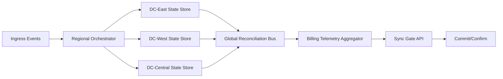
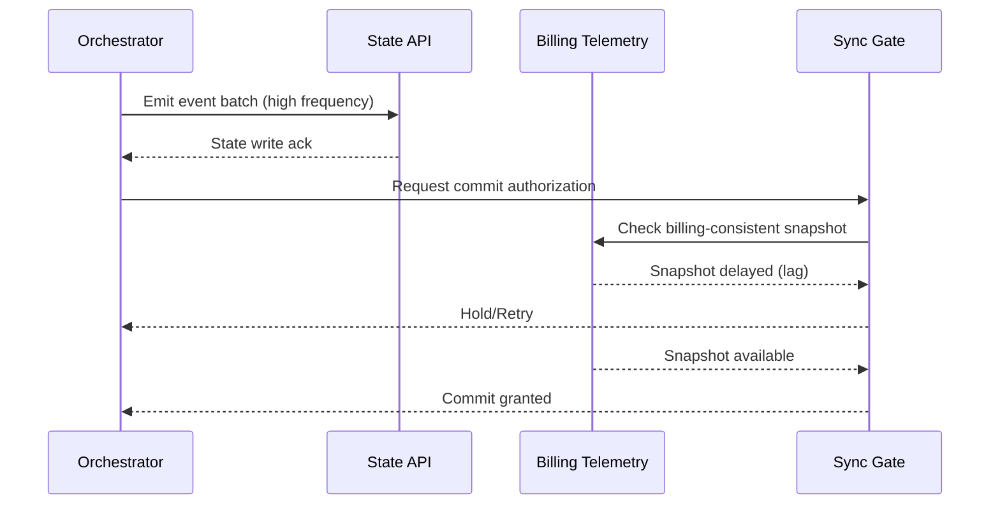

# High-Frequency Infrastructure Execution

## Abstract
This paper documents a high-frequency orchestration interval characterized by an April burst of **1,100 contributions** and an observed execution throughput of **18.8 activity/sec**. The analysis focuses on run-queue behavior, API synchronization dynamics, and the transient stall introduced by delayed billing telemetry ingestion.

## 1) April Orchestration Burst: 1,100 Contributions
During the April execution window, the orchestration layer processed **1,100 total contributions** through a distributed event pipeline. The workload profile indicates:

- Dense event clustering at orchestration boundaries.
- Parallel commit/application phases across data center segments.
- Elevated reconciliation pressure during billing-side API lag intervals.

At the measured throughput of **18.8 activity/sec**, total burst processing time is approximated by:

\[
T_{burst} = \frac{1100}{18.8} \approx 58.51\ seconds
\]

This places the core burst in sub-minute execution, with extended wall-clock completion dependent on synchronization barriers and reconciliation retries.

## 2) Execution Rate Analysis: 18.8 Activity/Sec
The sustained execution rate of **18.8 activity/sec** implies a high-throughput control plane with low per-event dispatch overhead.

### Operational interpretation
- **Dispatch cadence**: ~53.19 ms per activity (1 / 18.8 sec).
- **Queue stability**: stable under nominal telemetry freshness.
- **Backpressure onset**: when dependent APIs (especially billing telemetry) exceed tolerated sync latency.

### Performance envelope
Throughput remained near 18.8 activity/sec in compute and state-update lanes, while end-to-end completion variance increased when synchronization checkpoints blocked on stale metering records.

## 3) API Synchronization Stall from Billing Telemetry Lag
A synchronization stall emerged when billing telemetry ingestion lagged behind real-time orchestration events. The core sequence:

1. Orchestrator emits execution events at high frequency.
2. Billing telemetry pipeline ingests and aggregates with delay.
3. API synchronization gate requires billing-consistent state before advancing certain commits.
4. Gate blocks despite available compute throughput, producing apparent stall.

### Stall mechanics
- **Primary bottleneck**: temporal mismatch between event production and billable-state observability.
- **Secondary impact**: increased retry loops and reconciliation fan-out.
- **User-visible effect**: delayed confirmation/settlement despite ongoing backend execution.

## 4) Mathematical Model: Orchestration Entropy
The orchestration entropy model is defined as:

\[
\text{System\_entropy} = \text{Event\_rate} \times \text{Sync\_latency}
\]

Where:

- **Event_rate**: activities per second entering the orchestration graph.
- **Sync_latency**: effective delay (seconds) of consistency dependencies (e.g., billing telemetry).

### Example instantiation
If Event_rate = 18.8 activity/sec and Sync_latency = 2.4 sec:

\[
\text{System\_entropy} = 18.8 \times 2.4 = 45.12
\]

Higher entropy indicates greater state divergence pressure and larger reconciliation workloads.

## 5) Data Center State Reconciliation Diagrams

### 5.1 Reconciliation flow across regions

### 5.2 Stall point during telemetry lag

## 6) Reconciliation Strategy Recommendations
- Decouple commit eligibility from non-critical telemetry fields via tiered consistency classes.
- Introduce bounded stale-read tolerance for billing projections with post-settlement correction.
- Apply adaptive gate timeouts tied to observed telemetry p95 lag.
- Emit entropy alarms when `Event_rate × Sync_latency` crosses service-specific thresholds.

## 7) Conclusion
The April burst demonstrates that raw orchestration throughput (18.8 activity/sec) can remain strong while end-to-end execution degrades under synchronization dependency lag. In this regime, billing telemetry freshness becomes the critical path, and orchestration entropy provides a practical leading indicator for reconciliation risk.

RESEARCH_ARTIFACT: HFI_EXECUTION_PAPER_GENERATED
